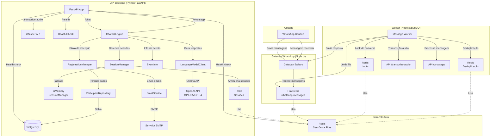
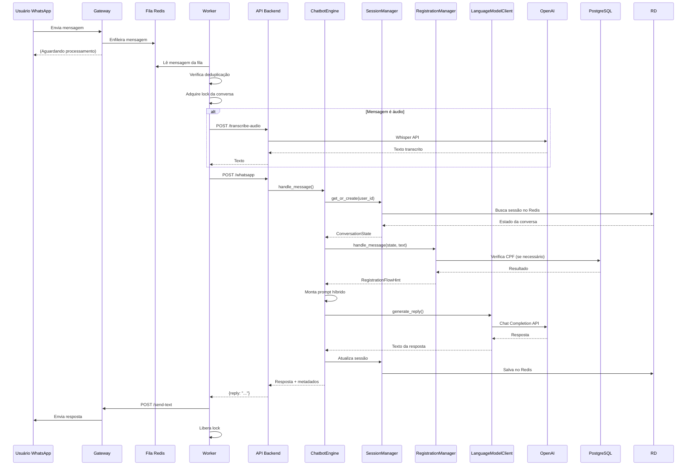

# Arquitetura do Congress Bot

Este documento descreve a arquitetura do sistema de chatbot para congresso na área do agro.

## Visão Geral

O sistema é composto por:
- **Gateway WhatsApp** (Node.js): Conecta ao WhatsApp via Baileys e recebe mensagens
- **Worker** (Node.js): Processa mensagens da fila e coordena com o backend
- **API Backend** (Python/FastAPI): Núcleo lógico do chatbot
- **Banco de Dados** (PostgreSQL): Armazena participantes e dados persistentes
- **Redis**: Gerencia sessões de conversa e filas de mensagens
- **OpenAI API**: Gera respostas usando modelos de linguagem

## Diagrama de Arquitetura



## Fluxo de Processamento de Mensagem



## Componentes Principais

### 1. Gateway WhatsApp (`whatsapp-gateway/`)

**Responsabilidades:**
- Conectar ao WhatsApp via Baileys
- Receber mensagens e enfileirar no Redis
- Enviar mensagens via endpoint `/send-text`
- Gerenciar autenticação WhatsApp (QR Code)

**Tecnologias:**
- Node.js + Express
- @whiskeysockets/baileys
- Redis (BullMQ para filas)

### 2. Worker (`whatsapp-gateway/worker/`)

**Responsabilidades:**
- Processar mensagens da fila Redis
- Deduplicação por `messageId`
- Lock por conversa (evita processamento paralelo)
- Extração de texto (texto, áudio, imagem)
- Transcrição de áudio via API
- Chamada ao backend Python
- Envio de resposta via gateway

**Tecnologias:**
- Node.js + BullMQ
- Baileys (para download de mídia)

### 3. API Backend (`app/api/http.py`)

**Endpoints:**
- `POST /whatsapp`: Recebe mensagens do gateway
- `POST /chat`: Endpoint genérico para chat
- `POST /transcribe-audio`: Transcreve áudio usando Whisper
- `GET /health`: Health check (Redis + DB)

**Tecnologias:**
- Python + FastAPI
- Uvicorn (ASGI server)

### 4. ChatbotEngine (`app/core/engine.py`)

**Responsabilidades:**
- Orquestrar o processamento de mensagens
- Gerenciar sessões de conversa
- Coordenar fluxo de inscrição
- Montar contexto para o modelo de linguagem
- Chamar LanguageModelClient

**Componentes:**
- `SessionManager`: Gerencia estado da conversa (Redis ou InMemory)
- `RegistrationManager`: Gerencia fluxo de inscrição passo a passo
- `LanguageModelClient`: Encapsula chamadas à OpenAI
- `EventInfo`: Carrega informações do evento (reais ou mockadas)

### 5. RegistrationManager (`app/core/registration_manager.py`)

**Fluxo de Inscrição:**
1. **IDLE**: Detecta intenção de inscrição
2. **ASKING_NAME**: Coleta nome completo
3. **ASKING_EMAIL**: Coleta e valida e-mail
4. **ASKING_CPF**: Coleta e valida CPF (verifica duplicatas)
5. **ASKING_PHONE**: Coleta telefone com DDD
6. **ASKING_CITY**: Coleta cidade
7. **ASKING_STATE**: Coleta estado (UF)
8. **ASKING_PROFILE**: Coleta perfil do participante
9. **CONFIRMING**: Confirma dados coletados
10. **COMPLETED**: Inscrição concluída

**Validações:**
- E-mail válido
- CPF válido (11 dígitos)
- Verificação de CPF duplicado
- Telefone normalizado
- Cidade/Estado normalizados

### 6. SessionManager (`app/session/redis_session_manager.py`)

**Responsabilidades:**
- Armazenar estado da conversa (histórico + dados de inscrição)
- TTL configurável (padrão: 7 dias)
- Fallback para InMemory se Redis não disponível
- Poda automática de histórico (limite de turnos)

**Estrutura de Dados:**
- `ConversationState`: Estado completo da conversa
  - `user_id`: ID do usuário
  - `history`: Lista de turnos (mensagens)
  - `registration_step`: Etapa atual do fluxo
  - `registration_data`: Dados coletados

### 7. LanguageModelClient (`app/infra/openai_client.py`)

**Responsabilidades:**
- Encapsular chamadas à API OpenAI
- Implementar retry com backoff exponencial + jitter
- Tratar timeouts e erros transitórios
- Construir payload no formato da API

**Configurações:**
- Timeout configurável
- Número máximo de retries
- Backoff exponencial com jitter

### 8. EmailService (`app/infra/email_service.py`)

**Responsabilidades:**
- Enviar e-mail de confirmação de inscrição
- Modo dev: apenas loga (não envia)
- Modo prod: envia via SMTP

### 9. Repository (`app/storage/repository.py`)

**Responsabilidades:**
- Abstrair acesso ao banco de dados
- Operações CRUD de participantes
- Validação de integridade

## Persistência de Dados

### PostgreSQL
- **Tabela `participants`**: Armazena dados dos participantes
  - `id`: PK auto-increment
  - `full_name`: Nome completo
  - `email`: E-mail (único)
  - `cpf`: CPF (único, 11 dígitos)
  - `phone`: Telefone
  - `city`: Cidade
  - `state`: Estado (UF)
  - `profile`: Perfil do participante
  - `created_at`: Timestamp de criação

### Redis
- **Sessões**: `session:{user_id}` (TTL: 7 dias)
- **Deduplicação**: `dedupe:msg:{messageId}` (TTL: 6 horas)
- **Locks**: `lock:jid:{remoteJid}` (TTL: 60s)
- **Fila**: `whatsapp-messages` (BullMQ)
- **Mapeamento**: `jid:number:{number}` (TTL: 7 dias)

## Segurança

### Autenticação
- **API Key**: `BOT_API_KEY` para endpoints protegidos
  - Modo `prod`: Obrigatório
  - Modo `dev`: Opcional (permite desenvolvimento sem chave)

### Validações
- CPF duplicado: Verificado antes de salvar
- E-mail válido: Validação básica
- Timeout: Limites configuráveis para evitar travamentos
- Rate limiting: Via BullMQ (concorrência configurável)

## Configuração

### Variáveis de Ambiente

**Backend (Python):**
- `OPENAI_API_KEY`: Chave da API OpenAI
- `OPENAI_MODEL`: Modelo a usar (padrão: gpt-3o-mini)
- `DATABASE_URL`: URL do banco de dados
- `REDIS_URL`: URL do Redis
- `BOT_API_KEY`: Chave de autenticação da API
- `ENV`: Ambiente (dev/prod)
- `SMTP_*`: Configurações de SMTP

**Gateway/Worker (Node.js):**
- `BOT_URL`: URL do backend Python
- `GATEWAY_URL`: URL do gateway
- `REDIS_HOST`: Host do Redis
- `BOT_API_KEY`: Chave de autenticação
- `QUEUE_CONCURRENCY`: Concorrência do worker

## Deploy

O sistema é containerizado usando Docker Compose:

```yaml
services:
  - postgres: Banco de dados
  - redis: Cache e filas
  - api: Backend Python
  - gateway: Gateway WhatsApp
  - worker: Worker de processamento
```

**Comandos:**
- `docker-compose up`: Inicia todos os serviços
- `docker-compose down`: Para todos os serviços
- `alembic upgrade head`: Aplica migrações do banco

## Observabilidade

### Logs
- **Backend**: `logs/app.log` (rotação automática)
- **Gateway**: `logs/gateway.log`
- **Worker**: Console + arquivo

### Health Checks
- `/health`: Verifica Redis + PostgreSQL
- Retorna status: `healthy`, `degraded`, `error`

### Métricas
- Request ID único por requisição
- Duração de processamento
- Número de turnos na conversa
- Status de retry (OpenAI)

## Escalabilidade

### Horizontal
- **Workers**: Múltiplos workers podem processar mensagens em paralelo
- **API**: Múltiplas instâncias da API (stateless)
- **Redis**: Suporta cluster Redis para alta disponibilidade

### Vertical
- **Concorrência**: Configurável via `QUEUE_CONCURRENCY`
- **Timeout**: Ajustável para diferentes modelos OpenAI
- **TTL**: Sessões expiram automaticamente

## Melhorias Futuras

1. **Cache de respostas**: Cachear respostas frequentes
2. **Analytics**: Dashboard de métricas
3. **Multi-idioma**: Suporte completo a múltiplos idiomas
4. **Webhooks**: Notificações de eventos importantes
5. **Testes**: Cobertura de testes automatizados

